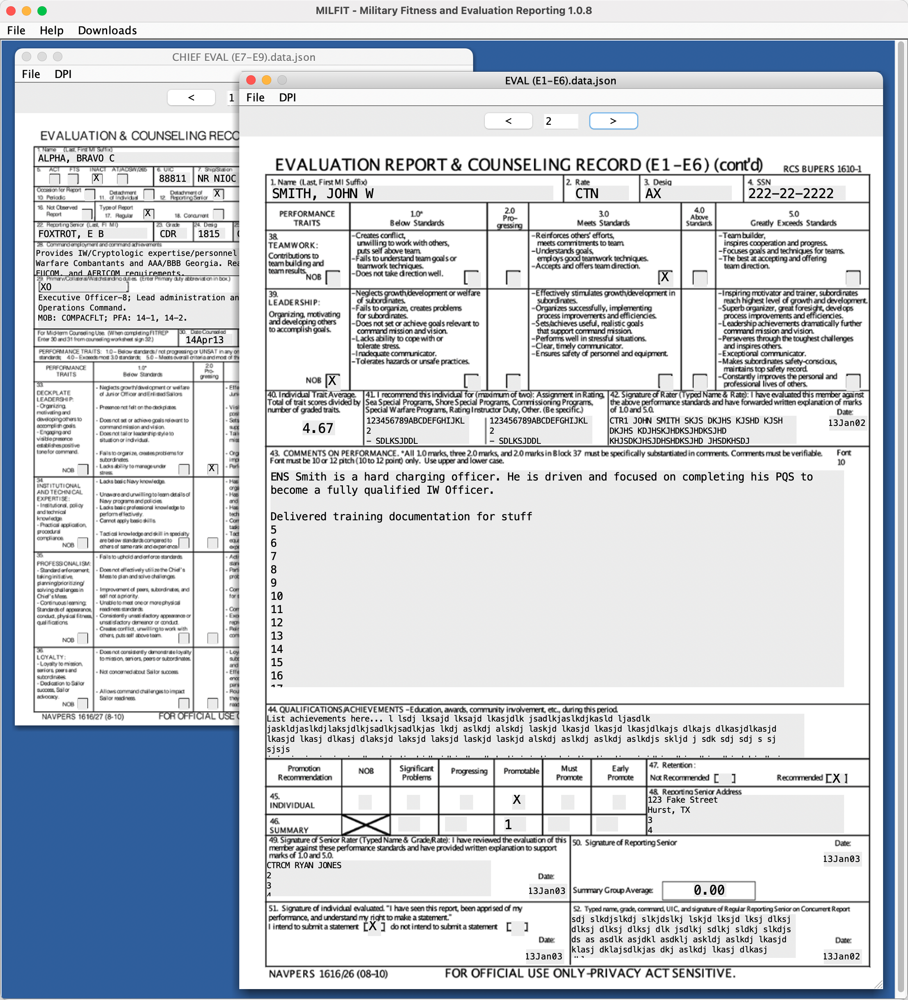
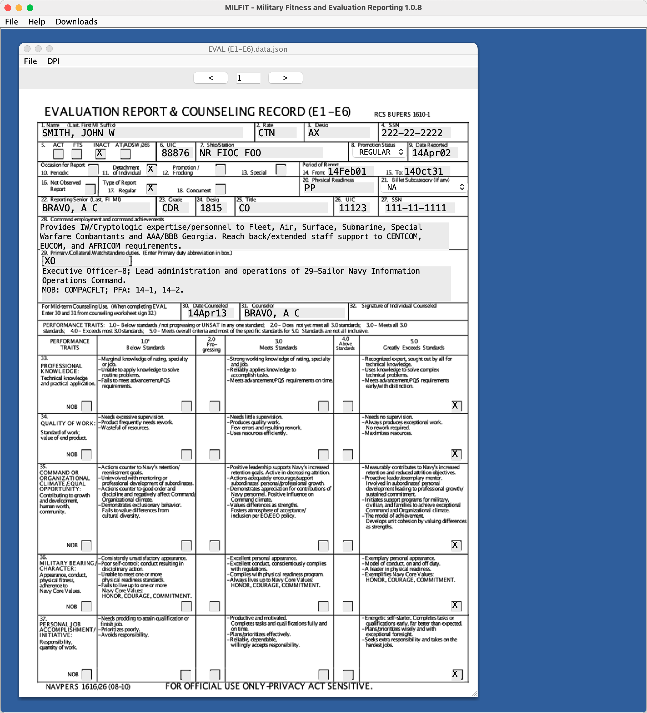
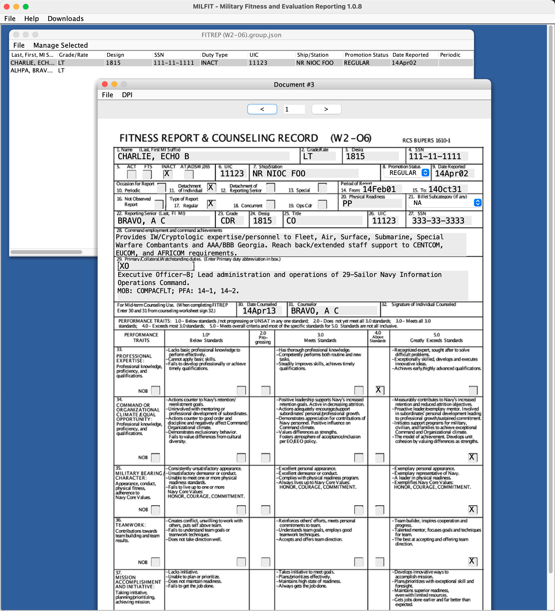
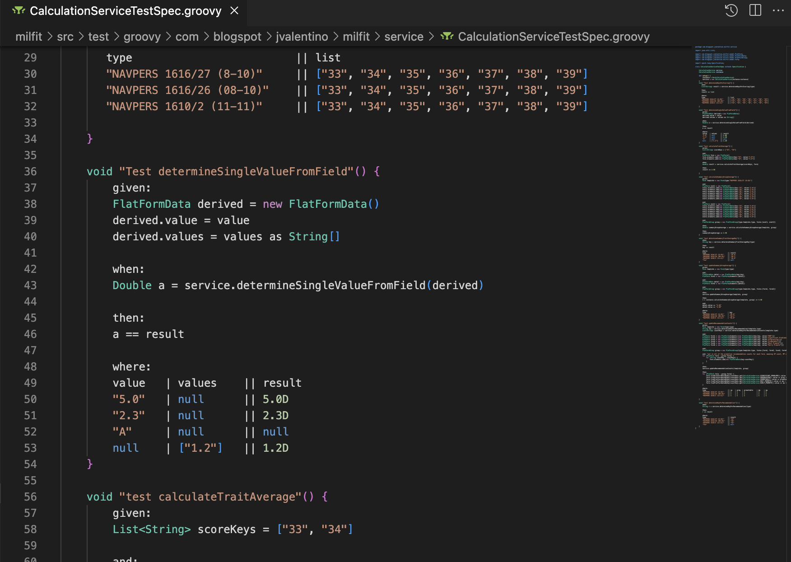
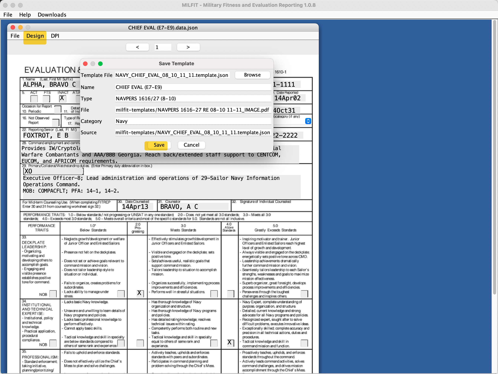

# MILFIT

Military Fitness and Evaluation Reporting

Every year in the Navy whether you are active duty or reserve, you have to go through a formal evaluation. That evalutation is a PDF based on rank that you download from navy.mil and then fillout. In 1998 someone made a program called [NAVFIT98](https://www.navyfitrep.com/2017/02/25/download-navfit-98/) to make this process "easier". Unforunately not only is getting this ancient program working painful, but its entire basis for storage is a series of microsoft access databases. Looking at this mess, I realized this could all be easily replace by something that just uses whatever the navy.mil PDFs are as template, and then just draws on top of them while allowing the work done to be saved in JSON. The program in use doesn't matter, because at the end of the day you are just submitting scanned PDF files.

Thus, Milfit was born.



## What?

•Replacement for NAVFIT

•Using modern software standards

•Runs on MAC and Windows

•Real-time spellcheck and validation

•Delivered over-the-web, as an installer, or as a standalone executable

•View/open multiple FITREPS/EVALS at a time

•CAC Integration for PDF Signing

## Why?

NAVFIT 98 is 

•Antiquated

•Error prone

•Not user friendly

•Windows only

•Infrequently updated

## Basic Design Features

•Deal with one FITREP/EVAL at a time

•Deal with multiple FITREPs/EVALs as a group

•Be able to add and remove FITREPs/EVALs to and from a group

•Multi-Window Desktop Interface

## Technical Design

•Source PDFs are used in their empty forms

•The application GUI converts the source PDF to an image and renders it on the screen

•The user/application provides the text that is written on top of the source PDF, which is output as separate PDF

•The source PDF can be changed at anytime, the application just has to provide the positional mappings of what fields go where (X,Y)

•This means the system works for any PDF

•The mapping of fields to X,Y positions are provided by an XML document for easy maintenance

•It is also possible to build a GUI to maintain or generate new field mappings to PDFs in the future

# Usage

In all cases, the basis of the types of forms you can use are from predefined templates setup for:

1. NAVY_CHIEF_EVAL_08_10_11_11 - Chiefs
2. NAVY_E6_EVAL_08_10 - E1 through E6
3. NAVY_FITREP_11_11 - W2-O6

Sorry, no general officers, yet.

Also, the prebuilt applications in Windows, Mac, and Linux formats are no longer available as a lot of the underlying capability for doing that has either been deprecated or massively changed. As a result, the only way to run this right now is to:

1. Have Java
2. Have Gradle 7.6+ installed
3. Have this entire codebase
4. Type "gradle run"

If someone thinks they can use this I can take the time though to get packaging working again.

## Single Form

This capability is accessed by either opening a a `data.json` file, or by selecting `File -> Individual Forms -> ...`

Its purpose is to be able to fillout the selected template, whereby you can then save your work and/or export it to a PDF for distribution.




## Multi Form

This capability is accessed by either opening a "group.json" file, or by selecting File -> Group of Forms -> ...

Its purpose is to be able to group together several individuals in the same ranking group, so that you can manage them together and all in one place.

Consider that if someone started out using the single form, it can be easily imported into any group.



# Technical Stuff

## How do I build it?

```bash
gradle clean build
```

I have high confidence in the applicaiton, because of the large number of high quality automated tests that let me know everything is working like it is supposed to.



## How do templates work?

Any `.template.json` file under `milfit-templates` is considered a template. Each template file contains the folowing basics:

- type - The type displayed in the application of the form. This is the official DOD form.
- file - The PDF file that is the basis for the template
- category - The name of the category under the file menu for which this option appears
- source - The location of this file
- name - The name displayed for this form in the app
- elements - A list of components that describe the nature of each field, including where it appears on the form.

```json
{
    "type": "NAVPERS 1616/27 (8-10)",
    "file": "milfit-templates/NAVPERS 1616-27 RE 08-10 11-11_IMAGE.pdf",
    "category": "Navy",
    "source": "milfit-templates/NAVY_CHIEF_EVAL_08_10_11_11.template.json",
    "name": "CHIEF EVAL (E7-E9)",
    "elements": [
        {
            "deriveValueFrom": null,
            "deriveValueUsing": null,
            "font": 12,
            "fonts": null,
            "height": 14,
            "key": "1",
            "maxChars": null,
            "maxCharss": null,
            "name": "Last, First, MI Suffix",
            "page": 1,
            "selections": null,
            "type": "TEXT",
            "valueFormat": null,
            "visualOffsetX": 0,
            "visualOffsetY": 0,
            "width": 260,
            "x": 30,
            "xs": null,
            "y": 730
        },
     ]
 }
```

### Design Mode

Big Help: In order to figure how to draw this stuff there is an internal design mode that can be enabled by setting designMode = true in AppState:

```groovy
class AppState {
    private static AppState instance
    
    String version = "1.0"
    String buildNumber = "0"
    String binaryName = "milfit"
    String host = "valentino-tech.com"
    boolean designMode = true

```



### Type: TEXT

Use for allowing general text entry at a specify point on the PDF

- font - The font size
- height - The height of the box
- key - The unique ID of this field in the form
- name - The friendly name for this field
- width - The width of the text field
- x - The x position of this component
- y - the y position of this component
- page - The page on which this component occurs

Example:

```json
{
            "deriveValueFrom": null,
            "deriveValueUsing": null,
            "font": 12,
            "fonts": null,
            "height": 14,
            "key": "1",
            "maxChars": null,
            "maxCharss": null,
            "name": "Last, First, MI Suffix",
            "page": 1,
            "selections": null,
            "type": "TEXT",
            "valueFormat": null,
            "visualOffsetX": 0,
            "visualOffsetY": 0,
            "width": 260,
            "x": 30,
            "xs": null,
            "y": 730
   }
```

### Type: CHECK_BOX_MULTI

The purpose of this field is to be a series of checkboxes, in which there can be multiple selections.

- font - The font size
- key - The unique ID of this field in the form
- name - The friendly name for this field
- xs - The x position of each of th options
- y - the y position of this component
- page - The page on which this component occurs
- selections - The list of checkbox names to display

```json
{
            "font": 12,
            "key": "5",
            "name": "Duty Type",
            "page": 1,
            "selections": [
                "ACT",
                "FTS",
                "INACT",
                "AT/ADSW/265"
            ],
            "type": "CHECK_BOX_MULTI",
            "x": 0,
            "xs": [
                48,
                71,
                103,
                135
            ],
            "y": 704.5
        },
```

### Type: TEXT with Selections

The purpose of this field is to be a drop-down where the user must select one of multiple options.

- font - The font size
- height - The height of the box
- key - The unique ID of this field in the form
- name - The friendly name for this field
- width - The width of the text field
- x - The x position of this component
- y - the y position of this component
- page - The page on which this component occurs
- selections - The list of options in the component

```json
{
            "deriveValueFrom": null,
            "deriveValueUsing": null,
            "font": 12,
            "fonts": null,
            "height": 14,
            "key": "8",
            "maxChars": null,
            "maxCharss": null,
            "name": "Promotion Status",
            "page": 1,
            "selections": [
            	"REGULAR",
            	"FROCKED",
            	"SELECTED",
            	"SPOT"
            ],
            "type": "TEXT",
            "valueFormat": null,
            "visualOffsetX": 0,
            "visualOffsetY": 0,
            "width": 78,
            "x": 435,
            "xs": null,
            "y": 704.5
        },
```

### Type: CHECK_BOX_BOOLEAN

The purpose is to just be a checkbox that is selected or not selected.

- font - The font size
- key - The unique ID of this field in the form
- name - The friendly name for this field
- x - The x position of this component
- y - the y position of this component
- page - The page on which this component occurs

```json
{
            "font": 12,
            "key": "10",
            "name": "Periodic",
            "page": 1,
            "type": "CHECK_BOX_BOOLEAN",
            "x": 93,
            "y": 684
        }
```

